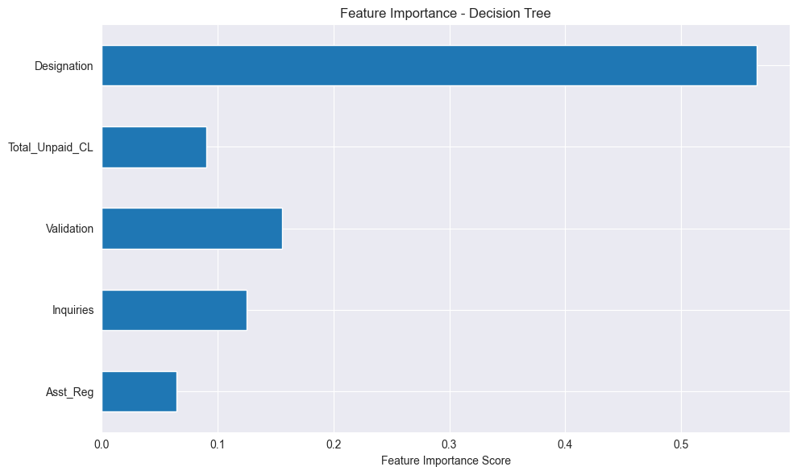
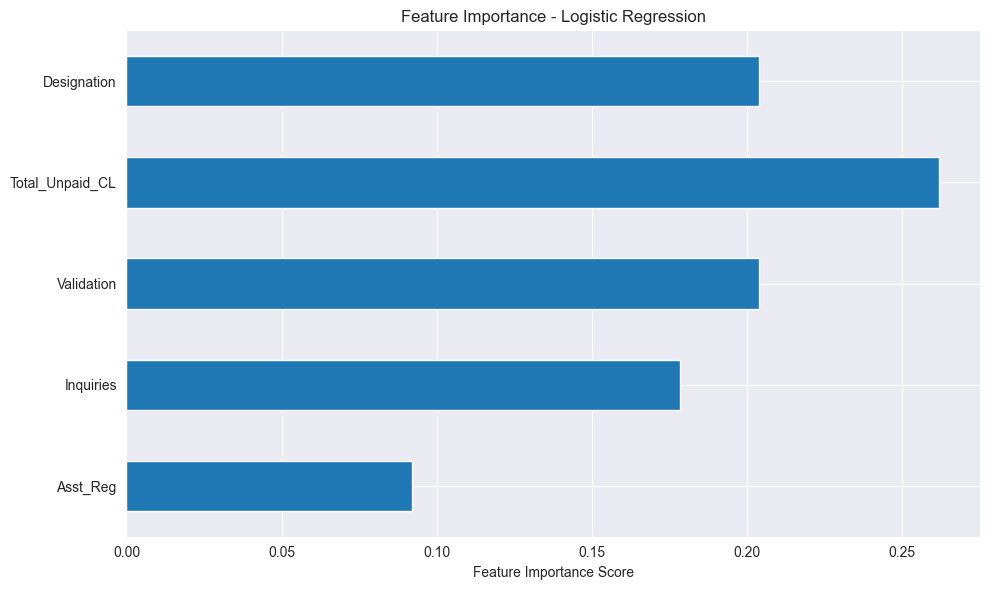
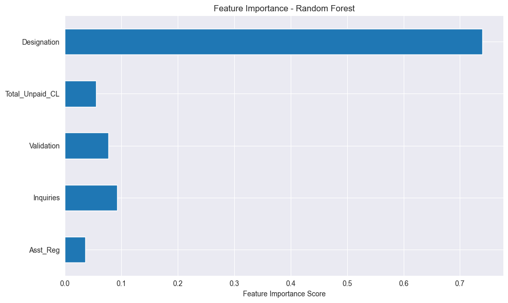

### An Analysis of Loan Default Likelihood

**George Li**

#### Executive summary

#### Rationale
Fintechs are increasingly relying on data beyond just a credit score to make credit decisions. This is because the credit score alone may have biases toward certain demographics and also only provides a limited view of a person who may not have a long credit history. Predictions like this allow fintechs to seek more customers without running the risks of taking on too many customers with higher likelihoods of delinquency.
#### Research Question
What factors are more predictive of whether a person is going to be able to pay back a loan or default?
#### Data Sources
Loan default dataset from Kaggle: https://www.kaggle.com/datasets/marcbuji/loan-default-prediction Links to an external site.
#### Methodology
Clustering Algorithms are necessary to determine the most significant features that contribute to whether someone defaults or not.

Classification algorithms to help predict whether someone defaults or not.

Hyperparams need to be tuned using grid search.
#### Results
Using Logistic Regression, Decision Trees, and Random Forest, we found that the most consequential feature that factors into defaults are the total amount of assets which is shown as Asst_Reg_encoded.

The other common feature that seems to be found pretty important in all three models is the Debt_to_Income ratio. Both of those would make sense in that if a person has fewer assets or higher amount of existing debt, the likelihood of default is significantly higher. 

Some Raw Results:

        Results for Logistic Regression:
        Best Parameters: {'C': 0.001, 'penalty': 'l2'}
        Best Cross-Validation Score: 0.8105
        Test Accuracy: 0.8122
        Runtime: 1.95 seconds
        Classification Report:
                      precision    recall  f1-score   support
        
                   0       0.82      0.99      0.90     10966
                   1       0.49      0.02      0.04      2533
        
            accuracy                           0.81     13499
           macro avg       0.65      0.51      0.47     13499
        weighted avg       0.75      0.81      0.74     13499
        
        
        Top 5 Most Important Features:
        Asst_Reg_encoded          0.436327
        Gross_Collection          0.282641
        Debt_to_Income            0.172694
        File_Status_fully paid    0.139858
        File_Status_whole         0.139858
        dtype: float64
        
        Results for Decision Tree:
        Best Parameters: {'max_depth': 5, 'min_samples_leaf': 1, 'min_samples_split': 2}
        Best Cross-Validation Score: 0.8122
        Test Accuracy: 0.8129
        Runtime: 9.75 seconds
        Classification Report:
                      precision    recall  f1-score   support
        
                   0       0.83      0.97      0.89     10966
                   1       0.50      0.15      0.23      2533
        
            accuracy                           0.81     13499
           macro avg       0.67      0.56      0.56     13499
        weighted avg       0.77      0.81      0.77     13499
        
        
        Top 5 Most Important Features:
        Asst_Reg_encoded          0.762356
        Duration_5 years          0.091902
        Gross_Collection          0.070318
        File_Status_fully paid    0.028482
        File_Status_whole         0.027476
        dtype: float64
        
        Results for Random Forest:
        Best Parameters: {'max_depth': None, 'min_samples_leaf': 2, 'min_samples_split': 5, 'n_estimators': 200}
        Best Cross-Validation Score: 0.8202
        Test Accuracy: 0.8192
        Runtime: 386.86 seconds
        Classification Report:
                      precision    recall  f1-score   support
        
                   0       0.82      0.99      0.90     10966
                   1       0.63      0.09      0.16      2533
        
            accuracy                           0.82     13499
           macro avg       0.73      0.54      0.53     13499
        weighted avg       0.79      0.82      0.76     13499
        
        
        Top 5 Most Important Features:
        Asst_Reg_encoded       0.166446
        Designation_encoded    0.062131
        Debt_to_Income         0.061590
        Present_Balance        0.057228
        Usage_Rate             0.056033
        dtype: float64
        
        Best overall model: Random Forest
        Best overall test accuracy: 0.8192
        Runtime for best model: 386.86 seconds
#### Next steps
What suggestions do you have for next steps?

#### Outline of project

- [Link to notebook 1]([analysis.ipynb](analysis.ipynb))

##### Contact and Further Information